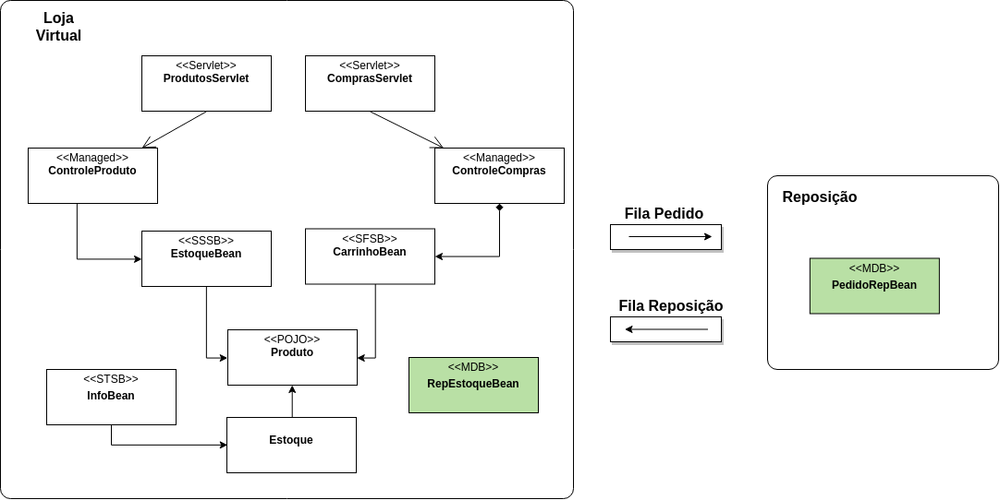

## Trabalho 02

Evolua a aplicação de loja virtual para incorporar regras de controle de estoque. Na versão 2 da loja, 
você deverá controlar o estoque dos produtos e solicitar reposição do estoque sempre que o pedido
ultrapassar a quantidade de itens disponíveis em estoque. 

Você deverá implementar também uma aplicação que será responsável por receber os pedidos de reposição 
(**reposicao-app**) e processá-los.

As regras de implementação serão as seguintes:

- Ao finalizar a compra no carrinho, você deverá checar a existência de produtos suficientes no estoque.
Em qualquer situação a compra será concluída, porém, caso não haja produtos suficientes, vocẽ deverá 
emitir um pedido de reposição;

- O pedido de reposição deverá indicar o produto e a quantidade necessária, sendo encaminhado para a
aplicação de reposição por meio de uma mensagem em fila específica;

- O processamento da reposição deverá ser respondido assincronamente por meio de uma  mensagem de retorno
informando o produto e a quantidade reposta.

Atenção aos seguintes pontos:

* Você poderá utilizar o ActiveMQ embarcado no Wildfly como JMS Provider;

* As filas são estruturas unidirecionais. Lembre-se de criar uma para cada sentido: pedido reposição, atualização do estoque;

* Vocês poderão utilizar Maven ou Gradle construção e geração da aplicação final. No caso do Gradle, 
descrevam os procedimentos necessários para construção e deploy;

* Não será obrigatório (porém **extremamente desejável**) o uso de Docker. Os exercícios [ex01](https://github.com/michelav-uni7/frameworks-comps/tree/master/exercicios/ex01) 
e [ex02](https://github.com/michelav-uni7/frameworks-comps/tree/master/exercicios/ex02) são bons exemplos para vocês preparem os _Dockerfiles_ necessários. Lembrem-se: _"Tudo será levado em consideração no dia do Juízo Final!"_

### Entrega

O trabalho 01 vale 3,0pts e deverá ser entregue até às 23h59m59s de 10/05/2019. Após essa data, o 
trabalho passará a valer 2,0pts.

Para realizar a entrega vocẽ deverá:

* Marcar o seu repositório com a tag _trab02_;

* Atualizar o arquivo _loja-virtual.md_ conforme as informações pedidas. Atentem para descrever tudo que
for necessário (comandos de construção, comandos no shell, etc) para construir e executar a aplicação de 
vocês.
