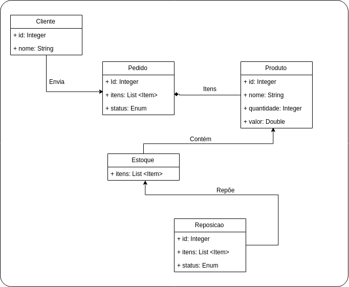

## Trabalho 03

A loja virtual _"QualquerCoisa"_ está criando uma API para venda de seus produtos no atacado e você foi
contratado para implementar essa API utilizando utilizando o framework Spring e seus projetos. 

Essa API atenderá a dois processos básicos da loja: (I) Venda de produtos pela Web,  (II) Controle de 
produtos em estoque e (III) Cadastro de entidades.

Veja o diagrama com as principais entidades abaixo:



### Cadastro de Entidades

Os requisitos de processo são:

- A loja deverá permitir o CRUD das seguintes entidades: ```Pedido```, ```Produto``` 
```Reposicao```, ```Estoque``` e ```Cliente```.
 

### Venda de produtos

O processo de venda de produtos será implementado pela interação entre as entidades: ```Pedido```, ```Produto``` 
```Reposicao``` e ```Estoque```. As regras do processo de venda serão as seguintes:

- Um cliente (já cadastrado na loja) ao enviar à aplicação uma lista de produtos e respectiva quantidade. A aplicação
deve responder a solicitação informando o pedido criado;

- Antes de processar o pedido, a aplicação deverá checar se há quantidade necessária em estoque para cada produto 
da lista;

- Caso a lista contenha produtos que não estão cadastrados na loja, a aplicação deverá retornar um erro informando
que não trabalha com esse tipo de produto;

- Caso não haja quantidade suficiente de qualquer produto para atender a solicitação do cliente, o pedido deverá 
ficar em aberto aguardando o processamento da Reposicao;

- Para calcular a quantidade de um produto a ser pedido na reposição, o sistema deverá utilizar um fator de 
reposição (_fRep_) inteiro e randômico variando entre o intervalo fechado [1, 3]. Por exemplo: Supondo que haja 10
 canetas em estoque, a loja receba um pedido de compra de 20 canetas e o fator de reposição seja 3; dessa forma, a 
 reposição deverá conter um pedido de 30 canetas;

- O _fRep_ deverá ser calculado para cada pedido de Reposição;

- Um pedido poderá ser cancelado enquanto estiver em aberto. As reposições criadas em decorrência do pedido não 
devem ser afetadas;   


### Controle de estoque

O processo de controle de estoque será implementado pela interação entre as entidades: ```Pedido```, ```Produto``` 
```Reposicao``` e ```Estoque```. As regras do processo de venda serão as seguintes:

- A principal função da entidade Estoque é controlar a quantidade de produtos existentes disponíveis para venda;

- Por meio do controle de estoque deverá ser possível:
	- Checar a quantidade de produtos disponíveis (total ou apenas para 1 produto);
	- Atualizar a quantidade de produtos disponíveis.

- Caso se tente atualizar a quantidade de um produto que não está cadastrado na loja, a aplicação deverá retornar 
um erro informando que não trabalha com esse tipo de produto;

- Uma Reposição consiste num pedido de atualização da quantidade de um (ou mais) produtos em estoque;

- Ao processar uma Reposição, a aplicação deve atualizar a quantidade de itens dos produtos constantes daquela
reposição no estoque;

- Não deverá ser possível processar uma reposição já processada ou cancelada; 

- O processamento de uma reposição poderá ser acionado por meio de um endpoint REST específico ou atualização do
status da reposição.


### Diretrizes Gerais

Atenção aos seguintes pontos:

- Você poderá utilizar qualquer recurso do framework Spring para realizar seu trabalho;

- Não será obrigatório (porém **extremamente desejável**) o uso de Docker. O exercício [ex05](https://github.com/michelav-uni7/frameworks-comps/tree/master/exercicios/ex05) 
é um bom exemplos para vocês preparem os _Dockerfiles_ necessários. Lembrem-se: _"Tudo será levado em consideração no dia do Juízo Final!"_

- O diagrama com as entidades não está completo. Ele apenas funciona como um modelo ilustrativo do problema.
 Faz parte do trabalho entendê-lo e implementá-lo, ajustando o curso da implementação conforme necessário. 

### Entrega

O trabalho 01 vale 4,5pts e deverá ser entregue até às 23h59m59s de 26/05/2019. Após essa data, o 
trabalho passará a valer 4,0pts.

Para realizar a entrega vocẽ deverá:

* Criar um branch com o nome _loja-virtual-spring_ e marcar o sua entrega com a tag _trab03_;

* Atualizar o arquivo _loja-virtual.md_ conforme as informações pedidas. Atentem para descrever tudo que
for necessário (comandos de construção, comandos no shell, etc) para construir e executar a aplicação de 
vocês.
